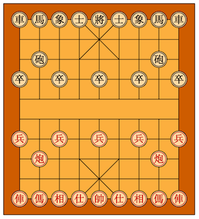

# XiangqiGame
This project is an implementation of a Xiangqi (Chinese Chess) game utilizing the Python standard library.   

To learn to play Xiangqi I would recommend visiting the [Xiangqi Wiki](https://en.wikipedia.org/wiki/Xiangqi) and [Ancient Chess](http://ancientchess.com/page/play-xiangqi.htm).

This is my first serious program in Python (and ever) and I hope to improve it over time to include revising the checkmate algorithm and potentially creating a visual board. 

## Download-  
To play this game clone this repo and run the xiangqigame.py file on the commandline.

## Getting started-
You begin the game by instantiating a game object. This will set up the board in the standard configuration.  
game = XiangqiGame()  
  
Moves are made using alrebraic notation to indicate the desired movement. 
game.make_move(“A5”,”A4”) 
